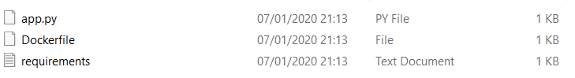
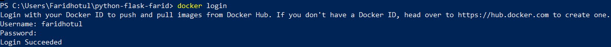
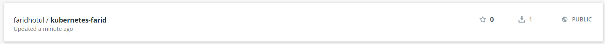
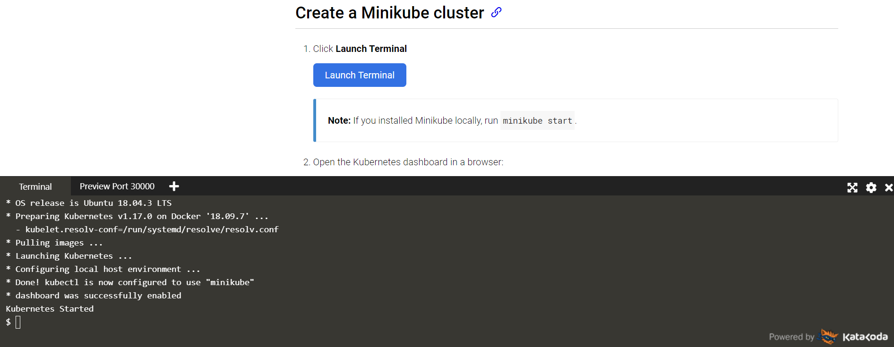
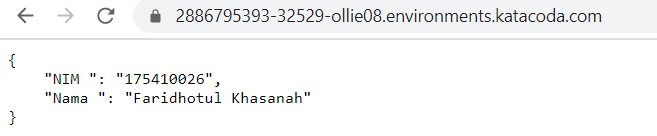

# PRAKTIKUM TEKNOLOGI CLOUD

## NAMA : FARIDHOTUL KHASANAH / 175410026
## UAS - KUBERNETES

## DEFINISI

## Komponen-Komponen Kubernetes

### Komponen Master

Komponen master menyediakan control plane bagi klaster. Komponen ini berperan dalam proses pengambilan secara global pada klaster, serta berperan dalam proses deteksi serta pemberian respons terhadap events yang berlangsung di dalam klaster. Komponen master dapat dijalankan di mesin manapun yang ada di klaster, untuk memudahkan proses yang ada, script inisiasi awal yang dijalankan biasanya memulai komponen master pada mesin yang sama, serta tidak menjalankan kontainer bagi pengguna di mesin ini.

1. kube-apiserver
Komponen di master yang mengekspos API Kubernetes. Merupakan front-end dari kontrol plane Kubernetes. Komponen ini didesain agar dapat di-scale secara horizontal.

2. etcd
Penyimpanan key value konsisten yang digunakan sebagai penyimpanan data klaster Kubernetes.

3. kube-scheduler
Komponen di master yang bertugas mengamati pod yang baru dibuat dan belum di-assign ke suatu node dan kemudian akan memilih sebuah node dimana pod baru tersebut akan dijalankan.

Faktor-faktor yang diperhatikan dalam proses ini adalah kebutuhan resource secara individual dan kolektif, konstrain perangkat keras/perangkat lunak/peraturan, spesifikasi afinitas dan non-afinitas, lokalisasi data, interferensi inter-workload dan deadlines.

4. kube-controller-manager
Komponen di master yang menjalankan kontroler.

Secara logis, setiap kontroler adalah sebuah proses yang berbeda, tetapi untuk mengurangi kompleksitas, kontroler-kontroler ini dikompilasi menjadi sebuah binary yang dijalankan sebagai satu proses. Kontroler-kontroler ini meliputi:

- Kontroler Node : Bertanggung jawab untuk mengamati dan memberikan respons apabila jumlah node berkurang.
- Kontroler Replikasi : Bertanggung jawab untuk menjaga jumlah pod agar jumlahnya sesuai dengan kebutuhan setiap objek kontroler replikasi yang ada di sistem.
- Kontroler Endpoints : Menginisiasi objek Endpoints (yang merupakan gabungan Pods dan Services).
- Kontroler Service Account & Token: Membuat akun dan akses token API standar untuk setiap namespaces yang dibuat.

# KASUS

## Membuat docker image

1. Membuat direktori

``` mkdir python-flask-farid ```

2. Membuat 3 buah file seperti dibawah ini :



- isi file app.py

```
# app.py - a minimal flask api using flask_restful
from flask import Flask
from flask_restful import Resource, Api

app = Flask(__name__)
api = Api(app)

class HelloWorld(Resource):
    def get(self):
        return {'Nama ': 'Faridhotul Khasanah', 'NIM ': '175410026'}

api.add_resource(HelloWorld, '/')

if __name__ == '__main__':
    app.run(debug=True, host='0.0.0.0') 
```

- isi file DockerFile

```
#https://medium.com/@mtngt/docker-flask-a-simple-tutorial-bbcb2f4110b5

FROM python:2.7
COPY . /app
WORKDIR /app
RUN pip install -r requirements.txt
ENTRYPOINT ["python"]
CMD ["app.py"]

```

- isi File requirement

```
flask
flask_restful
```

3. Login kedalam dockerhub yang sudah pernah dibuat saat UTS



4. Membuat docker image kedalam dockerhub

```
PS C:\Users\Faridhotul\python-flask-farid> docker build -t faridhotul/kubernetes-farid .
Sending build context to Docker daemon  4.096kB
Step 1/6 : FROM python:2.7
2.7: Pulling from library/python
8f0fdd3eaac0: Pull complete
d918eaefd9de: Pull complete
43bf3e3107f5: Pull complete
27622921edb2: Pull complete
dcfa0aa1ae2c: Pull complete
ef6ca6913068: Pull complete
a755ea00feee: Pull complete
74b6f9ff9fd6: Pull complete
bebb4b693476: Pull complete
Digest: sha256:9517f5314968111658d229ed3038630a174e7a4f1b852bd185b70f614dffba08
Status: Downloaded newer image for python:2.7
 ---> 426ba9523d99
Step 2/6 : COPY . /app
 ---> 00da5eab4a0d
Step 3/6 : WORKDIR /app
 ---> Running in 3e34eafd35a1
Removing intermediate container 3e34eafd35a1
 ---> 873fb7042716
Step 4/6 : RUN pip install -r requirements.txt
 ---> Running in 9a22181de6db
DEPRECATION: Python 2.7 will reach the end of its life on January 1st, 2020. Please upgrade your Python as Python 2.7 won't be maintained after that date. A future version of pip will drop support for Python 2.7. More details about Python 2 support in pip, can be found at https://pip.pypa.io/en/latest/development/release-process/#python-2-support
Collecting flask
  Downloading https://files.pythonhosted.org/packages/9b/93/628509b8d5dc749656a9641f4caf13540e2cdec85276964ff8f43bbb1d3b/Flask-1.1.1-py2.py3-none-any.whl (94kB)
Collecting flask_restful
  Downloading https://files.pythonhosted.org/packages/17/44/6e490150ee443ca81d5f88b61bb4bbb133d44d75b0b716ebe92489508da4/Flask_RESTful-0.3.7-py2.py3-none-any.whl
Collecting itsdangerous>=0.24
  Downloading https://files.pythonhosted.org/packages/76/ae/44b03b253d6fade317f32c24d100b3b35c2239807046a4c953c7b89fa49e/itsdangerous-1.1.0-py2.py3-none-any.whl
Collecting Jinja2>=2.10.1
  Downloading https://files.pythonhosted.org/packages/65/e0/eb35e762802015cab1ccee04e8a277b03f1d8e53da3ec3106882ec42558b/Jinja2-2.10.3-py2.py3-none-any.whl (125kB)
Collecting click>=5.1
  Downloading https://files.pythonhosted.org/packages/fa/37/45185cb5abbc30d7257104c434fe0b07e5a195a6847506c074527aa599ec/Click-7.0-py2.py3-none-any.whl (81kB)
Collecting Werkzeug>=0.15
  Downloading https://files.pythonhosted.org/packages/ce/42/3aeda98f96e85fd26180534d36570e4d18108d62ae36f87694b476b83d6f/Werkzeug-0.16.0-py2.py3-none-any.whl (327kB)
Collecting aniso8601>=0.82
  Downloading https://files.pythonhosted.org/packages/eb/e4/787e104b58eadc1a710738d4e418d7e599e4e778e52cb8e5d5ef6ddd5833/aniso8601-8.0.0-py2.py3-none-any.whl (43kB)
Collecting pytz
  Downloading https://files.pythonhosted.org/packages/e7/f9/f0b53f88060247251bf481fa6ea62cd0d25bf1b11a87888e53ce5b7c8ad2/pytz-2019.3-py2.py3-none-any.whl (509kB)
Collecting six>=1.3.0
  Downloading https://files.pythonhosted.org/packages/65/26/32b8464df2a97e6dd1b656ed26b2c194606c16fe163c695a992b36c11cdf/six-1.13.0-py2.py3-none-any.whl
Collecting MarkupSafe>=0.23
  Downloading https://files.pythonhosted.org/packages/fb/40/f3adb7cf24a8012813c5edb20329eb22d5d8e2a0ecf73d21d6b85865da11/MarkupSafe-1.1.1-cp27-cp27mu-manylinux1_x86_64.whl
Installing collected packages: itsdangerous, MarkupSafe, Jinja2, click, Werkzeug, flask, aniso8601, pytz, six, flask-restful
Successfully installed Jinja2-2.10.3 MarkupSafe-1.1.1 Werkzeug-0.16.0 aniso8601-8.0.0 click-7.0 flask-1.1.1 flask-restful-0.3.7 itsdangerous-1.1.0 pytz-2019.3 six-1.13.0
Removing intermediate container 9a22181de6db
 ---> 7377f7e02646
Step 5/6 : ENTRYPOINT ["python"]
 ---> Running in 8ed9c1b801d5
Removing intermediate container 8ed9c1b801d5
 ---> a8c75af5022f
Step 6/6 : CMD ["app.py"]
 ---> Running in 9a89d7f0f9f6
Removing intermediate container 9a89d7f0f9f6
 ---> 372abc9f1888
Successfully built 372abc9f1888
Successfully tagged faridhotul/kubernetes-farid:latest
SECURITY WARNING: You are building a Docker image from Windows against a non-Windows Docker host. All files and directories added to build context will have '-rwxr-xr-x' permissions. It is recommended to double check and reset permissions for sensitive files and directories.
```

5. Cek apakah docker image sudah sukses terbuat

```
PS C:\Users\Faridhotul\python-flask-farid> docker images
REPOSITORY                    TAG                 IMAGE ID            CREATED             SIZE
faridhotul/kubernetes-farid   latest              372abc9f1888        4 minutes ago       903MB
python                        2.7                 426ba9523d99        10 days ago         896MB
```

6. Lakukan push kedalam dockerhub

```PS C:\Users\Faridhotul\python-flask-farid> docker images
REPOSITORY                    TAG                 IMAGE ID            CREATED             SIZE
faridhotul/kubernetes-farid   latest              372abc9f1888        About an hour ago   903MB
python                        2.7                 426ba9523d99        10 days ago         896MB
PS C:\Users\Faridhotul\python-flask-farid> docker push faridhotul/kubernetes-farid
The push refers to repository [docker.io/faridhotul/kubernetes-farid]
e9ccc57548a0: Pushed
daf0a3a29faa: Pushed
a98ea9b99554: Mounted from library/python
03a3dc679282: Mounted from library/python
35fc403d4c4c: Mounted from library/python
c1fbc35a2660: Mounted from library/python
f63773c65620: Mounted from library/python
e6d60910d056: Mounted from library/python
b52c1c103fae: Mounted from library/python
6f1c84e6ec59: Mounted from library/python
dd5242c2dc8a: Mounted from library/python
latest: digest: sha256:54ce9e25213d6fcde359abdc83bd5f71b76eba5b431d9513d57daad6153aabb9 size: 2639
```

7. Cek kedalam https://hub.docker.com/repositories



## Menjalankan DockerImage yang terdapat di DockerHub menggunakan Kubernetes

Sebelum menjalankan proses dibawah ini silahkan buka link berikut : https://kubernetes.io/docs/tutorials/hello-minikube/. Kemudian klik **Launch Terminal**



Pod dalam Kubernetes adalah kumpulan dari satu atau banyak Container yang saling terhubung untuk kebutuhan administrasi dan jaringan. Deployment dalam Kubernetes selalu memeriksa kesehatan Pod dan melakukan restart saat Kontainer di dalam Pod tersebut mati. Deployment digunakan untuk membuat dan mereplikasi Pod.

1. Menggunakan perintah kubectl create untuk membuat Deployment. Pod menjalankan Container berdasarkan image docker yang digunakan. Disini saya menggunakan image docker faridhotul/kubernetes-farid (image ini saya buat pada pertemuan 8, yang telah saya push ke Docker Hub). Pada Deployment ini Pod hanya memiliki 1 Container saja.

```
$ kubectl create deployment farid-python-flask --image=faridhotul/kubernetes-farid
deployment.apps/farid-python-flask created
```

2. Cek deployment

```
$ kubectl get deployments
NAME                 READY   UP-TO-DATE   AVAILABLE   AGE
farid-python-flask   0/1     1            0           10s
```


3. Melihat Pod yang sudah dibuat

```
$ kubectl get pods
NAME                                  READY   STATUS    RESTARTS   AGE
farid-python-flask-684454bdb9-9mwvv   1/1     Running   0          116s
```

4. Melihat event yang terjadi pada Cluster

```
$ kubectl get events
LAST SEEN   TYPE      REASON                    OBJECT                                     MESSAGE
2m45s       Normal    Scheduled                 pod/farid-python-flask-684454bdb9-9mwvv    Successfully assigned default/farid-python-flask-684454bdb9-9mwvv to minikube
2m40s       Normal    Pulling                   pod/farid-python-flask-684454bdb9-9mwvv    Pulling image "faridhotul/kubernetes-farid"
108s        Normal    Pulled                    pod/farid-python-flask-684454bdb9-9mwvv    Successfully pulled image "faridhotul/kubernetes-farid"
106s        Normal    Created                   pod/farid-python-flask-684454bdb9-9mwvv    Created container kubernetes-farid
105s        Normal    Started                   pod/farid-python-flask-684454bdb9-9mwvv    Started container kubernetes-farid
```

5. Melihat konfigurasi kubectl

```
$ kubectl config view
apiVersion: v1
clusters:
- cluster:
    certificate-authority: /root/.minikube/ca.crt
    server: https://172.17.0.129:8443
  name: minikube
contexts:
- context:
    cluster: minikube
    user: minikube
  name: minikube
current-context: minikube
kind: Config
preferences: {}
users:
- name: minikube
  user:
    client-certificate: /root/.minikube/client.crt
    client-key: /root/.minikube/client.key
```

## Membuat Sebuah Service

Secara default, Pod hanya bisa diakses melalui alamat IP internal di dalam cluster Kubernetes. Supaya Container python-flask bisa diakses dari luar jaringan virtual Kubernetes, saya harus ekspos Pod sebagai Service Kubernetes.

1. Ekspos Pod pada internet publik menggunakan perintah kubectl expose --type-LoadBalancer digunakan untuk ekspos Service keluar dari Cluster.

```
$ kubectl expose deployment farid-python-flask --type=LoadBalancer --port=5000
service/farid-python-flask exposed
```

2. Melihat Service yang telah dibuat

```
$ kubectl get services
NAME                 TYPE           CLUSTER-IP      EXTERNAL-IP   PORT(S)          AGE
farid-python-flask   LoadBalancer   10.96.196.108   <pending>     5000:32529/TCP   25s
kubernetes           ClusterIP      10.96.0.1       <none>        443/TCP          11m
```

Port 32529 digunakan untuk mengakse pada browser

3. Akses pada browser menggunakan port 32529 (dapat dilihat pada service).

