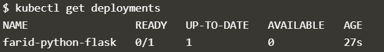

# PRAKTIKUM TEKNOLOGI CLOUD

## NAMA : FARIDHOTUL KHASANAH / 175410026
## UAS - KUBERNETES

## Membuat docker image

1. Membuat direktori

``` mkdir python-flask-farid ```

2. Membuat 3 buah file seperti dibawah ini :


- isi file app.py

```
# app.py - a minimal flask api using flask_restful
from flask import Flask
from flask_restful import Resource, Api

app = Flask(__name__)
api = Api(app)

class HelloWorld(Resource):
    def get(self):
        return {'Nama ': 'Faridhotul Khasanah', 'NIM ': '175410026'}

api.add_resource(HelloWorld, '/')

if __name__ == '__main__':
    app.run(debug=True, host='0.0.0.0') 
```

- isi file DockerFile

```
#https://medium.com/@mtngt/docker-flask-a-simple-tutorial-bbcb2f4110b5

FROM python:2.7
COPY . /app
WORKDIR /app
RUN pip install -r requirements.txt
ENTRYPOINT ["python"]
CMD ["app.py"]

```

- isi File requirement

```
flask
flask_restful
```

3. Login kedalam dockerhub yang sudah pernah dibuat saat UTS


4. Membuat docker image kedalam dockerhub, pada saat ini kita melakukan push kedalam dockerhub. 

```
PS C:\Users\Faridhotul\python-flask-farid> docker build -t faridhotul/kubernetes-farid .
Sending build context to Docker daemon  4.096kB
Step 1/6 : FROM python:2.7
2.7: Pulling from library/python
8f0fdd3eaac0: Pull complete
d918eaefd9de: Pull complete
43bf3e3107f5: Pull complete
27622921edb2: Pull complete
dcfa0aa1ae2c: Pull complete
ef6ca6913068: Pull complete
a755ea00feee: Pull complete
74b6f9ff9fd6: Pull complete
bebb4b693476: Pull complete
Digest: sha256:9517f5314968111658d229ed3038630a174e7a4f1b852bd185b70f614dffba08
Status: Downloaded newer image for python:2.7
 ---> 426ba9523d99
Step 2/6 : COPY . /app
 ---> 00da5eab4a0d
Step 3/6 : WORKDIR /app
 ---> Running in 3e34eafd35a1
Removing intermediate container 3e34eafd35a1
 ---> 873fb7042716
Step 4/6 : RUN pip install -r requirements.txt
 ---> Running in 9a22181de6db
DEPRECATION: Python 2.7 will reach the end of its life on January 1st, 2020. Please upgrade your Python as Python 2.7 won't be maintained after that date. A future version of pip will drop support for Python 2.7. More details about Python 2 support in pip, can be found at https://pip.pypa.io/en/latest/development/release-process/#python-2-support
Collecting flask
  Downloading https://files.pythonhosted.org/packages/9b/93/628509b8d5dc749656a9641f4caf13540e2cdec85276964ff8f43bbb1d3b/Flask-1.1.1-py2.py3-none-any.whl (94kB)
Collecting flask_restful
  Downloading https://files.pythonhosted.org/packages/17/44/6e490150ee443ca81d5f88b61bb4bbb133d44d75b0b716ebe92489508da4/Flask_RESTful-0.3.7-py2.py3-none-any.whl
Collecting itsdangerous>=0.24
  Downloading https://files.pythonhosted.org/packages/76/ae/44b03b253d6fade317f32c24d100b3b35c2239807046a4c953c7b89fa49e/itsdangerous-1.1.0-py2.py3-none-any.whl
Collecting Jinja2>=2.10.1
  Downloading https://files.pythonhosted.org/packages/65/e0/eb35e762802015cab1ccee04e8a277b03f1d8e53da3ec3106882ec42558b/Jinja2-2.10.3-py2.py3-none-any.whl (125kB)
Collecting click>=5.1
  Downloading https://files.pythonhosted.org/packages/fa/37/45185cb5abbc30d7257104c434fe0b07e5a195a6847506c074527aa599ec/Click-7.0-py2.py3-none-any.whl (81kB)
Collecting Werkzeug>=0.15
  Downloading https://files.pythonhosted.org/packages/ce/42/3aeda98f96e85fd26180534d36570e4d18108d62ae36f87694b476b83d6f/Werkzeug-0.16.0-py2.py3-none-any.whl (327kB)
Collecting aniso8601>=0.82
  Downloading https://files.pythonhosted.org/packages/eb/e4/787e104b58eadc1a710738d4e418d7e599e4e778e52cb8e5d5ef6ddd5833/aniso8601-8.0.0-py2.py3-none-any.whl (43kB)
Collecting pytz
  Downloading https://files.pythonhosted.org/packages/e7/f9/f0b53f88060247251bf481fa6ea62cd0d25bf1b11a87888e53ce5b7c8ad2/pytz-2019.3-py2.py3-none-any.whl (509kB)
Collecting six>=1.3.0
  Downloading https://files.pythonhosted.org/packages/65/26/32b8464df2a97e6dd1b656ed26b2c194606c16fe163c695a992b36c11cdf/six-1.13.0-py2.py3-none-any.whl
Collecting MarkupSafe>=0.23
  Downloading https://files.pythonhosted.org/packages/fb/40/f3adb7cf24a8012813c5edb20329eb22d5d8e2a0ecf73d21d6b85865da11/MarkupSafe-1.1.1-cp27-cp27mu-manylinux1_x86_64.whl
Installing collected packages: itsdangerous, MarkupSafe, Jinja2, click, Werkzeug, flask, aniso8601, pytz, six, flask-restful
Successfully installed Jinja2-2.10.3 MarkupSafe-1.1.1 Werkzeug-0.16.0 aniso8601-8.0.0 click-7.0 flask-1.1.1 flask-restful-0.3.7 itsdangerous-1.1.0 pytz-2019.3 six-1.13.0
Removing intermediate container 9a22181de6db
 ---> 7377f7e02646
Step 5/6 : ENTRYPOINT ["python"]
 ---> Running in 8ed9c1b801d5
Removing intermediate container 8ed9c1b801d5
 ---> a8c75af5022f
Step 6/6 : CMD ["app.py"]
 ---> Running in 9a89d7f0f9f6
Removing intermediate container 9a89d7f0f9f6
 ---> 372abc9f1888
Successfully built 372abc9f1888
Successfully tagged faridhotul/kubernetes-farid:latest
SECURITY WARNING: You are building a Docker image from Windows against a non-Windows Docker host. All files and directories added to build context will have '-rwxr-xr-x' permissions. It is recommended to double check and reset permissions for sensitive files and directories.
```

5. Cek apakah docker image sudah sukses terbuat

```
PS C:\Users\Faridhotul\python-flask-farid> docker images
REPOSITORY                    TAG                 IMAGE ID            CREATED             SIZE
faridhotul/kubernetes-farid   latest              372abc9f1888        4 minutes ago       903MB
python                        2.7                 426ba9523d99        10 days ago         896MB
```

## Menjalankan DockerImage yang terdapat di DockerHub menggunakan Kubernetes

Sebelum menjalankan proses dibawah ini silahkan buka link berikut : https://kubernetes.io/docs/tutorials/hello-minikube/. Kemudian klik **Launch Terminal**


Pod dalam Kubernetes adalah kumpulan dari satu atau banyak Container yang saling terhubung untuk kebutuhan administrasi dan jaringan. Deployment dalam Kubernetes selalu memeriksa kesehatan Pod dan melakukan restart saat Kontainer di dalam Pod tersebut mati. Deployment digunakan untuk membuat dan mereplikasi Pod.

1. Menggunakan perintah kubectl create untuk membuat Deployment. Pod menjalankan Container berdasarkan image docker yang digunakan. Disini saya menggunakan image docker faridhotul/kubernetes-farid (image ini saya buat pada pertemuan 8, yang telah saya push ke Docker Hub). Pada Deployment ini Pod hanya memiliki 1 Container saja.

```
$ kubectl create deployment farid-python-flask --image=faridhotul/kubernetes-farid
deployment.apps/farid-python-flask created
```

2. Cek deployment

```
$ kubectl get deployments
NAME                 READY   UP-TO-DATE   AVAILABLE   AGE
farid-python-flask   0/1     1            0           27s
```



3. Melihat Pod yang sudah dibuat

```
$ kubectl get pods
NAME                                  READY   STATUS             RESTARTS   AGE
farid-python-flask-684454bdb9-v4kkv   0/1     ImagePullBackOff   0          118s
```

4. Melihat event yang terjadi pada Cluster

```
$ kubectl get events
LAST SEEN   TYPE      REASON                    OBJECT                                     MESSAGE
2m11s       Normal    Scheduled                 pod/farid-python-flask-684454bdb9-v4kkv    Successfully assigned default/farid-python-flask-684454bdb9-v4kkv to minikube
19s         Normal    Pulling                   pod/farid-python-flask-684454bdb9-v4kkv    Pulling image "faridhotul/kubernetes-farid"
17s         Warning   Failed                    pod/farid-python-flask-684454bdb9-v4kkv    Failed to pull image "faridhotul/kubernetes-farid": rpc error: code = Unknown desc = Error response from daemon: pull access denied for faridhotul/kubernetes-farid, repository does not exist or may require 'docker login'
17s         Warning   Failed                    pod/farid-python-flask-684454bdb9-v4kkv    Error: ErrImagePull
2s          Normal    BackOff                   pod/farid-python-flask-684454bdb9-v4kkv    Back-off pulling image "faridhotul/kubernetes-farid"
2s          Warning   Failed                    pod/farid-python-flask-684454bdb9-v4kkv    Error: ImagePullBackOff
2m12s       Normal    SuccessfulCreate          replicaset/farid-python-flask-684454bdb9   Created pod: farid-python-flask-684454bdb9-v4kkv
2m12s       Normal    ScalingReplicaSet         deployment/farid-python-flask              Scaled up replica set farid-python-flask-684454bdb9 to 1
9m23s       Normal    Starting                  node/minikube                              Starting kubelet.
9m23s       Normal    NodeHasSufficientMemory   node/minikube                              Node minikube status is now: NodeHasSufficientMemory
9m23s       Normal    NodeHasNoDiskPressure     node/minikube                              Node minikube status is now: NodeHasNoDiskPressure
9m23s       Normal    NodeHasSufficientPID      node/minikube                              Node minikube status is now: NodeHasSufficientPID
9m22s       Normal    RegisteredNode            node/minikube                              Node minikube event: Registered Node minikube in Controller
9m22s       Normal    NodeAllocatableEnforced   node/minikube                              Updated Node Allocatable limit across pods
9m19s       Normal    Starting                  node/minikube                              Starting kube-proxy.
9m12s       Normal    NodeReady                 node/minikube                              Node minikube status is now: NodeReady
6m44s       Normal    Scheduled                 pod/python-flask-657f9cc946-hh6kd          Successfully assigned default/python-flask-657f9cc946-hh6kd to minikube
5m10s       Normal    Pulling                   pod/python-flask-657f9cc946-hh6kd          Pulling image "faridhotul/kubernetes-farid"
5m8s        Warning   Failed                    pod/python-flask-657f9cc946-hh6kd          Failed to pull image "faridhotul/kubernetes-farid": rpc error: code = Unknown desc = Error response from daemon: pull access denied for faridhotul/kubernetes-farid, repository does not exist or may require 'docker login'
5m8s        Warning   Failed                    pod/python-flask-657f9cc946-hh6kd          Error: ErrImagePull
4m55s       Normal    BackOff                   pod/python-flask-657f9cc946-hh6kd          Back-off pulling image "faridhotul/kubernetes-farid"
4m42s       Warning   Failed                    pod/python-flask-657f9cc946-hh6kd          Error: ImagePullBackOff
6m44s       Normal    SuccessfulCreate          replicaset/python-flask-657f9cc946         Created pod: python-flask-657f9cc946-hh6kd
6m44s       Normal    ScalingReplicaSet         deployment/python-flask                    Scaled up replica set python-flask-657f9cc946 to 1
```

5. Melihat konfigurasi kubectl

```
$ kubectl config view
apiVersion: v1
clusters:
- cluster:
    certificate-authority: /root/.minikube/ca.crt
    server: https://172.17.0.129:8443
  name: minikube
contexts:
- context:
    cluster: minikube
    user: minikube
  name: minikube
current-context: minikube
kind: Config
preferences: {}
users:
- name: minikube
  user:
    client-certificate: /root/.minikube/client.crt
    client-key: /root/.minikube/client.key
```

## Membuat Sebuah Service

Secara default, Pod hanya bisa diakses melalui alamat IP internal di dalam cluster Kubernetes. Supaya Container python-flask bisa diakses dari luar jaringan virtual Kubernetes, saya harus ekspos Pod sebagai Service Kubernetes.

1. Ekspos Pod pada internet publik menggunakan perintah kubectl expose --type-LoadBalancer digunakan untuk ekspos Service keluar dari Cluster.

```
$ kubectl expose deployment farid-python-flask --type=LoadBalancer --port=5000
service/farid-python-flask exposed
```

2. Melihat Service yang telah dibuat

```
$ kubectl get services
NAME                 TYPE           CLUSTER-IP      EXTERNAL-IP   PORT(S)          AGE
farid-python-flask   LoadBalancer   10.96.196.108   <pending>     5000:32529/TCP   25s
kubernetes           ClusterIP      10.96.0.1       <none>        443/TCP          11m
```